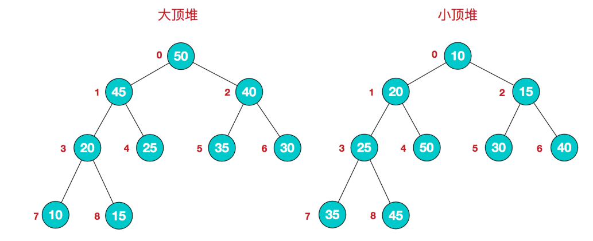
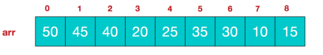

# 一沓排序
    本节的代码部分在一个统一的文件Sort.cpp里，设有一个main函数，可以直接取消里面对应的注释来测试不同的排序所用的时间；
---

## 直接插入排序
就是将一个数列分成两份，一份是已排序好的，一份是没排序的，然后把没排序组里的元素一一挪到排序好的组里，最后就都排好序了。
时间复杂度最少为O(n)，最差为O(n^2)；

---

## 二分排序
又叫折半插入排序，就是优化后的直接插入排序，优化的部分是无序区来的元素插入有序区时采用“二分查找”的方式插入，节省了一些时间；

---

## 希尔排序
是一种分组插入的方法；
先将数列分成d个组，然后其中跨距为d的元素为一个小组，然后每个小组进行插入排序，一次循环过后减小d，这样循环循环好多遍直到d==0，这时就剩一个分组了就是整个数列，在进行一遍插入排序就好了；
这个的性能分析比较复杂，有人说时间复杂度时O(logn)，有的人说是O(n^1.3)，不过因为程序里每个排序都有计时器，大家可以运行一下比较时间看看；

---

## 冒泡排序
这是最简单的一种排序了，总之就是让最大/最小的元素像冒泡泡一样冒到前面，相邻两个元素比较大小，小的/大的元素向前移；这个算法很稳定，但效率不敢恭维，平均状态下的时间复杂苏为O(n^2)；

---

## 快速排序
优化版的冒泡排序，每一趟划分就是选定一个基准元素，所有比它小/大的放在左边，比他大/小的放右边，然后对这两个部分在进行一次划分，以此循环，有点像归并排序；
这是一种应用非常广泛的算法，已被写进了库里，可以直接调用sort()来使用快速排序；

---

## 简单选择排序
这算法的原理乍看起来有一丝高大上，仔细一看 “这跟冒泡排序有区别吗？？” ，虽然划分了有序区和无序区，但是····原理是从无序区选出一个最小的元素与无序区的第一个元素交换，然后循环循环循环····也就是说最小的元素依次冒到上面来，最后等无序区没了就排好了····这**跟冒泡没区别呀？？

---

## 堆排序
首先你要先把你的数组变成一个堆，堆分为小顶堆和大顶堆，每个结点的值都大于或等于其左右孩子结点的值，称为大顶堆，反之就是小顶堆；

然后将其映射到数组中：

>堆排序的基本思想是：将待排序序列构造成一个大顶堆，此时，整个序列的最大值就是堆顶的根节点。将其与末尾元素进行交换，此时末尾就为最大值。然后将剩余n-1个元素重新构造成一个堆，这样会得到n个元素的次小值。如此反复执行，便能得到一个有序序列了

---

## 归并排序
这个可以总结一句话—— “ 分-治-合 ”；此乃江湖三字真言，一言既出即光耀世间，杀的鬼子是片甲不留哇~
咳咳，这仨字就是说【欲治整个数组，必先分其子孙，分而治之，归一融合】

---
