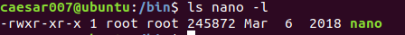

# Linux system study record

---
> 目前使用的是Ubuntu，不过命令在各个版本的Linux上大都是通用的

---

## 常用的shell命令
 
command | function
:------:|:-------:
ls      | 目录信息查看
cd      | 目录切换
pwd     | 当前路径显示
uname   | 系统信息查看
clear   | 清理屏幕
cat     | 显示文件内容
sudo    | 切换用户身份
cp      | 文件拷贝
su      | 切换用户
mv      | 移动文件
mkdir   | 创建文件夹
touch   | 创建文件
rm      | 删除
rmdir   | 目录删除
ifconfig| 显示网络配置信息，需要安装net-tools，根据提示安装
reboot  | 重启
poweroff| 关机
man     | 系统帮助
sync    | 数据同步写入磁盘
find    | 查找文件
grep    | 查找内容
du      | 文件夹大小查看
df      | 磁盘空间查看
gedit   | 使用gedit打开某文件
ps      | 当前的系统进程查看
top     | 进程实时运行状态查看
file    | 文件类型查看

---

## Install software by API

使用apt包管理工具需要root权限，所以命令格式为：
`sudo apt-get install [software name]`
19版本的Ubuntu好像不需要加get了

---

## Install deb software package by command deb

dpkg命令也需要root权限：
`sudo dpkg -i xxxx.deb`
所谓deb文件，就相当于Windows下的exe文件

---

## File structure

name  |  mean
:----:|:-----
bin   | 存放二进制可执行文件
sbin  | 二进制文件，一般是系统开机过程所需要的命令
boot  | Ubuntu内核和可执行文件
dev   | 设备驱动文件
etc   | 系统配置文件，如账号和密码文件
home  | 默认用户主文件夹
lib   | 存放库文件
media | 存放可插拔设备
mnt   | 用户可使用的挂载点，如果要挂载一些额外的设备可以挂载在这里
opt   | 可选的文件和程序存放目录，给第三方软件放置的目录
root  | 系统管理员目录
srv   | 服务相关目录，如网络服务
tmp   | 临时目录
var   | 存放一些变化的文件如日志文件
usr   | Unix Software Resource，存放系统用户有关的文件
proc  | 虚拟文件系统，数据放置到内存中，存放系统运行信息

---

## Disk and Index capacity require command

1. df: 列出文件系统的整体磁盘使用量，主要看单个文件系统的使用
2. du: 评估文件系统的磁盘使用量，主要看单个文件的大小

---

## Commonly used compression formats under Linux

1. .tar
2. .tar.bz.2
3. .tar.gz

---

## Compressing files with gzip tool (.gz format and not packed)

`gzip xxx`
对文件进行压缩；
`gzip -r xxx`
对文件夹进行压缩，但不进行打包；

---

## Tar packed tool

`tar -vcf test test.tar`
打包
`tar -vxf test.tar`
解包

---

## Other format files compression

rar格式，需要先安装rar：sudo apt-get install rar
`rar x xxx.rar`解压缩
`rar a xxx.rar xxx`压缩

zip格式
`zip -rv xxx.zip xxx`压缩
`unzip -v xxx.zip`解压缩

---

## User and User group

可以使用工具gnome-system-tools通过图形化界面控制，这需要安装
gnome··· 可以通过apt直接安装;

也可以通过命令创建：

对用户：
1. 添加用户： adduser
2. 用户查询： finger
3. 修改用户密码： passwd
4. 删除用户： deluser

对用户组：
1. 添加用户组： addgroup
2. 显示组内用户名： groups
3. 删除用户组： delgroup

---

## File permissions

权限类型 | 符号
:------:|:----:
读      |r
写      |w
执行    |x

面向的对象有——用户——用户组内成员——其他用户
显示的格式为：right-right-right  对应  user-group member-other，例如下面：

修改权限：chmod
修改文件所属用户：chown

---

## File link

1. 硬链接
