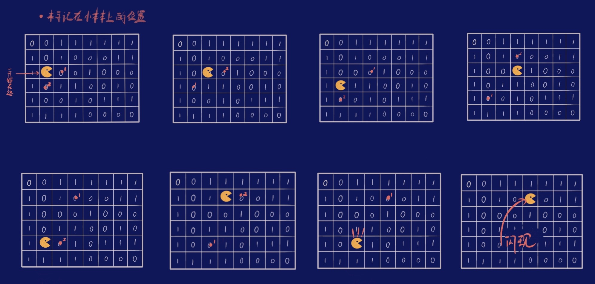

# 迷宫系列

>问题：
>有一个n*m的移动迷宫，啊不是，静止的迷宫~
>0代表有路——1代表有怪兽——你需要计算出从起点到
>终点要走的步数(不一定最短)反正要出去
>
>输入：
>第一行：n , m
>然后输入n*m的迷宫

## 解法1：BFC广度优先遍历，使用queue + pair：

#### 参数解读：
     g数组存储迷宫，d数组存储“走到这里走了多少步”，d的状态转移公式
     (这里用到了DP的概念，不过只是方便表达一下)是:
        **d[x][y] = d[x'][y'] + 1;**
     也就是：走到这一步所走的步数是走到上一个位置的步数加一；

     这里声明了一个pair，然后声明了一个pair型的queue，方便存储坐标x\y;  
     你可能还注意到有个奇怪的for循环参数 “auto &v” 是个神么，不要慌，最
     下面的【知识补充】里有简要解读;
     
#### 开始了：
     过程很简单：从起点开始走，在路口处看看四周哪有路，有路的方向记下到
     小本本上，待会儿一个个试，而且每试一个方向之前都得先在小本本上把这
     个方向划掉防止忘记了之后重走以至于掉进死循环（预防AD从我做起），如
     果在这个方向走到头没路了，这时，小本本上的没被划掉的地方开始的第一
     行就是你刚才遇到的岔路口的位置，你就可以安全返回啦~ 然后在岔路口重
     复动作，然后重复重复······什么时候本本空了，就该结束了！这个时候只
     有两种可能：
     
**一：你出去啦，完结撒花；**
**二：你没出去你死了，完结撒花；**

好了概述完了我们看看如何实现：
首先，小本本，由于要记录x和y，同时又想用到一种先进先出的结构，自
然想到了queue，然后想到了pair，于是就有了queue<pair>q;
技术细节见【知识补充】;

走的过程中的上下左右方向我们定义在两个数组dx和dy里，这样以后在路口
处可以通过循环很方便的遍历四个方向；

初始化后直接进入迷宫，其他部分不赘述了，我猜有个地方很多人可能不是
很明白，为什么每次取出一个坐标后总要将其从队里删除？    

```cpp
auto t = q.front();
q.pop();
```

原因是这样：

中间循环计算步数，利用上面得出的步数状态方程；

**这其实就是一个广度优先遍历，同时记录多条路径并同时寻访的方式**

好了，这道题解说的差不多了，总之还是属于比较简单的一类题目，下面
还有几种方法，不过就不会那么详细了；
#### 【知识补充】
1. pair——孪生数据体，通过first和second来操作其中的两个data；一开始我
   们用typedef给pair起了个别名叫PII，typedef是为类型起别名的；
2. auto是一个c++11标准的类型推断关键字，根据变量初始值推断类型，所以
   使用auto时得有初始值；比如这道题中用到了auto t = q.front()，这时t
   就自动适配为PII类型；可能你的编译器不支持auto，emmm这代表你该更新了
3. for循环还可以通过迭代器来运行，这里的迭代器可能跟你以前在vector里
   用的iterator不一样，这里我们用指针操作，&v:d 让v取得d的起始地址，这
   里d是一个二维数组，所以要分层遍历，需要第二个起始地址&x:v，也就是v遍
   历层，x遍历列；
-------

## 解法2：使用栈，其实使用栈跟使用队列差不多，只是遍历顺序不同，但最终都将迷宫遍历一遍，所以不再赘述了。
-------

## 解法3：递归
