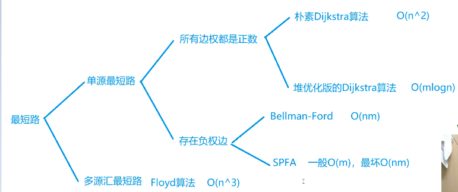
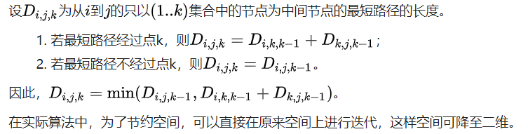

# 最短路径问题

## 描述
    给定一个map，求解从指定起始节点至指定终点的最短路径；下面介绍三种常用方法
    1. Dijkstra  
    2. Spfa  
    3. Floyd  
    
    这三种方式各有其特色，也有各自的局限性，下面将通过一个具体的题目来演示：

> ### 题目描述
> 给定一个n个点m条边的有向图，图中可能存在重边和自环，所有边权均为正值。
> 请你求出1号点到n号点的最短距离，如果无法从1号点走到n号点，则输出-1。
>**输入格式**
>第一行包含整数n和m。
>接下来m行每行包含三个整数x，y，z，表示点x和点y之间存在一条有向边，边长为z。
>
>**输出格式**
>输出一个整数，表示1号点到n号点的最短距离;
>如果路径不存在，则输出-1。
>
>**数据范围**
>1≤n≤500,
>1≤m≤105,
>图中涉及边长均不超过10000。

## 稠密图与稀疏图
首先先熟悉这个概念，因为涉及到选择存储数据的方式，最常用的是邻接表与邻接矩阵，对于不同类型的图这两种方式的效率差别较大；
当一个map的节点数比边数多很多时，这个map就是一个稀疏图，这时如果用邻接矩阵存储的话会有很多的零在里面影响效率，所以这时候就可以用邻接表来存储，因为它只存非零节点；相反如果节点数很多时就适合用邻接矩阵存储了；

---

## Dijkstra
使用了广度优先搜索解决赋权有向图或者无向图的单源最短路径问题，算法最终得到一个最短路径树。该算法常用于路由算法或者作为其他图算法的一个子模块;
该算法时间复杂度为O(n*m);

### Code
    代码部分见库——Dijkstra.cpp;

---

## Spfa
现在改一下题目，增加一条：可能存在负权边；这时使用Dij可能不是最好的选择;
SPFA算法是Bellman-Ford算法的队列优化算法的别称，通常用于求含负权边的单源最短路径，以及判负权环。SPFA一般情况复杂度是O(m)最坏情况下复杂度和Bellman-Ford相同，为O(nm)
这个算法主要是对 “松弛” 这个步骤做了优化，原来是不管有没有更新过的点都会松弛一遍，spfa则是用一个queue存储更新过的点;
spfa算法可以适用于有负权边的场景，Dijkstra则不能；时间复杂度而言，spfa平时也要比Dij快，最坏情况下跟Dij一样；不过有时候某些比赛里会设置对spfa的限制；

### Code
    代码部分见库——Spfa.cpp;

---

## Floyd-Warshall
Floyd的原理是动态规划，不过原理很简单，如下：

也就是D(i,j) = min(D(i,k) , D(k,j)); 这就是它的状态转移公式;
errr，该算法也不能解决负权环问题，关于如何解决带有负权环的图，我个人认为，只要在输入图的时候见到边权为负的边时把他变成正的然后起点终点对换一下不就没有负权了嘛···咳咳，由于这个人比较懒，所以还没实验。

### Code
    代码部分见库——Floyd.cpp;

---